# Backend Architecture Diagrams

This document captures the architecture of `apps/api` as it is implemented today. Every module gets a focused diagram (routes → services → repositories → tables, plus inbound and outbound events). The system-level diagram at the top shows how the pieces fit together.

The diagrams use Mermaid. They render natively in GitHub, VS Code (with the Markdown Preview Mermaid extension), and most modern markdown viewers.

---

## 1. System overview

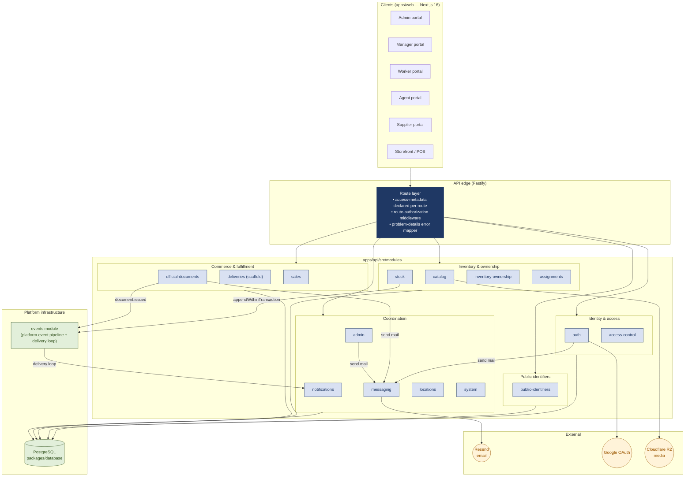

**Key architectural choices**

- Modular monolith (ADR-0001). One Fastify process; modules are import-isolated.
- Append-only ledgers for ownership (ADR-0003). No row updates.
- SKU is the stock-bearing identity (ADR-0010). Catalog, stock, ownership, and reservations all key on `sku_id`.
- Public identifiers only on the wire (ADR-0002). Slugs and reference numbers in responses; no raw DB IDs.
- Route-level access enforcement (ADR-0004). Every protected route declares an access policy and the middleware refuses to register routes without one.
- Platform events with a durable outbox (ADR-0012, ADR-0013). Producers append in-transaction; the delivery loop fans out to subscribers.
- Browser session auth (ADR-0006). Refresh token in an HTTP-only cookie; access tokens are short-lived and carry no roles.

---

## 2. Cross-cutting infrastructure

### 2.1 `_core` — error handling and route contract

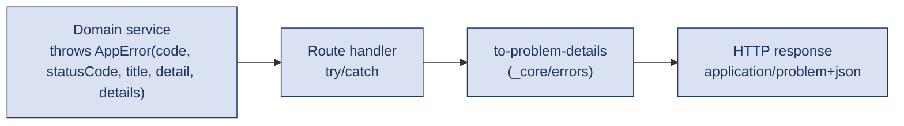

`_core/route-contract.ts` defines the access metadata that every route is required to declare. The `guard:routes` script and `route-authorization` middleware enforce that no route registers without it.

### 2.2 `events` — platform-event backbone

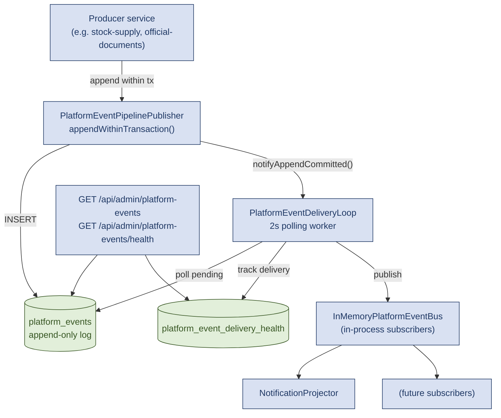

Events carry `actor`, `audience` (user-scoped or permission-scoped with optional location), `id`, `occurredAt`, `payload`, `resource`, `summary`, and `type`. They are persisted, not ephemeral; the delivery loop tracks per-subscription health.

---

## 3. Identity & access

### 3.1 `auth` — authentication, sessions, account recovery

```mermaid
flowchart TB
    subgraph Routes["Routes (apps/api/src/modules/auth)"]
        R1["auth.routes<br/>POST /api/auth/login<br/>POST /api/auth/logout<br/>POST /api/auth/refresh"]
        R2["auth-oauth.routes<br/>GET /api/auth/google/init<br/>GET /api/auth/google/callback"]
        R3["auth-recovery.routes<br/>POST /api/auth/password-reset<br/>POST /api/auth/email-verify"]
    end

    subgraph Services["Services"]
        Authn["authentication.service<br/>password + lockout policy"]
        Sess["session.service<br/>refresh-token cookie"]
        Reg["registration.service"]
        OAuth2["google-oauth.service"]
        Tok["access-token-authentication.service"]
        Lifecycle["user-access-lifecycle.service"]
        EmailVer["email-verification.service"]
        PwdReset["password-reset.service"]
        CurUser["current-user.service"]
        CurPerm["current-user-permission.service"]
    end

    subgraph Repos["Repositories"]
        UR["postgres-user"]
        SR["postgres-session"]
        AR["postgres-auth-user-record"]
        AS["postgres-user-account-state"]
        AE["postgres-user-auth-events"]
        OR["postgres-oauth-identity"]
        RR["postgres-user-recovery"]
    end

    subgraph DB["Tables (packages/database)"]
        T1[("users")]
        T2[("refreshTokens")]
        T3[("authEvents")]
        T4[("oauthIdentities")]
        T5[("passwordResetTokens<br/>emailVerificationTokens")]
    end

    R1 --> Authn --> UR --> T1
    R1 --> Sess --> SR --> T2
    Authn --> AE --> T3
    Authn --> AS --> T1
    R2 --> OAuth2 --> OR --> T4
    R3 --> EmailVer --> RR --> T5
    R3 --> PwdReset --> RR
    Tok --> AR --> T1
    CurUser --> UR
    CurPerm --> AccessCtrl[("access-control<br/>permission-resolution.service")]

    EmailVer -- "send mail" --> Msg[(messaging)]
    PwdReset -- "send mail" --> Msg
    OAuth2 -- "OAuth code exchange" --> Google[(Google OAuth)]

    classDef route fill:#1F3864,stroke:#1F3864,color:#fff
    classDef svc fill:#D9E1F2,stroke:#1F3864,color:#1F3864
    classDef repo fill:#FCE4D6,stroke:#C65911,color:#C65911
    classDef tbl fill:#E2EFDA,stroke:#375623,color:#375623
    classDef ext fill:#FFF3D9,stroke:#9C5700,color:#9C5700
    class R1,R2,R3 route
    class Authn,Sess,Reg,OAuth2,Tok,Lifecycle,EmailVer,PwdReset,CurUser,CurPerm svc
    class UR,SR,AR,AS,AE,OR,RR repo
    class T1,T2,T3,T4,T5 tbl
    class Msg,Google,AccessCtrl ext
```

### 3.2 `access-control` — permission resolution

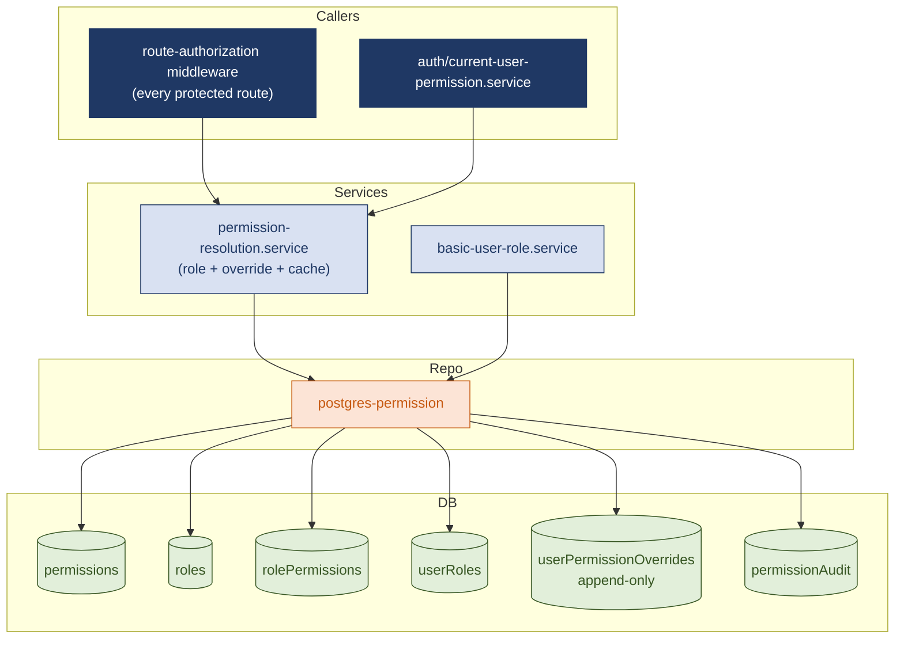

Resolution precedence (per ADR-0008): explicit user override beats role grant; deny beats allow at the same precedence.

---

## 4. Public identifiers

### 4.1 `public-identifiers` — slugs and reference numbers

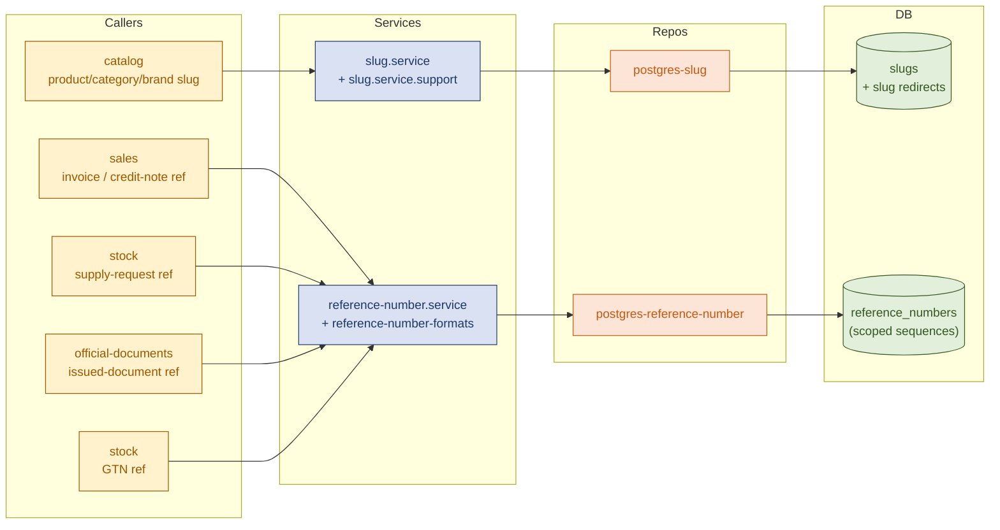

Reference-number generation runs inside the producing transaction, which is the source of uniqueness (no separate sequence service round trip). Slug allocation tracks redirect history per ADR-0009.

---

## 5. Inventory and ownership

### 5.1 `catalog` — products, variants, brands, categories, media

```mermaid
flowchart TB
    subgraph Routes["Routes"]
        AQ["catalog-admin-query.routes<br/>GET /api/admin/catalog/*"]
        AW["catalog-admin-write.routes<br/>POST/PATCH /api/admin/catalog/*"]
        AO["catalog-admin-product-options.routes"]
        BR["catalog-brand.routes"]
        MR["catalog-media.routes<br/>POST /api/catalog/media/upload"]
        MQ["catalog-manager-query.routes<br/>GET /api/catalog/products (manager)"]
    end

    subgraph Services
        ProdQ["catalog-product-query.service"]
        ProdW["catalog-product-write.service"]
        CatQ["catalog-category-query.service"]
        CatW["catalog-category-write.service"]
        BrandQ["catalog-brand-query.service"]
        BrandW["catalog-brand-write.service"]
        Media["catalog-media.service"]
        Loader["catalog-primary-image.loader<br/>(DataLoader)"]
    end

    subgraph Repos
        PQ["postgres-catalog-product-query"]
        PW["postgres-catalog-product-write<br/>+ archive-guard, delete-guard"]
        VW["postgres-catalog-variant-write"]
        VS["postgres-variant-search"]
        Opt["postgres-catalog-product-options"]
        BQ["postgres-catalog-brand-query"]
        BW["postgres-catalog-brand-write"]
        CQ["postgres-catalog-category-query"]
        CW["postgres-catalog-category-write"]
        MD["postgres-catalog-media"]
    end

    subgraph DB
        P[("products")]
        V[("productVariants")]
        Br[("catalogBrands")]
        Cg[("categories<br/>(parent hierarchy)")]
        Mm[("productMedia")]
    end

    AQ --> ProdQ --> PQ --> P
    AQ --> CatQ --> CQ --> Cg
    AQ --> BrandQ --> BQ --> Br
    AW --> ProdW --> PW --> P
    AW --> ProdW --> VW --> V
    AO --> ProdW --> Opt --> V
    BR --> BrandW --> BW --> Br
    MR --> Media --> MD --> Mm
    MQ --> ProdQ
    ProdQ --> VS --> V
    Loader --> MD

    Media --> R2[(Cloudflare R2)]
    ProdW --> Slugs[(public-identifiers<br/>slug.service)]
    BrandW --> Slugs
    CatW --> Slugs

    classDef route fill:#1F3864,stroke:#1F3864,color:#fff
    classDef svc fill:#D9E1F2,stroke:#1F3864,color:#1F3864
    classDef repo fill:#FCE4D6,stroke:#C65911,color:#C65911
    classDef tbl fill:#E2EFDA,stroke:#375623,color:#375623
    classDef ext fill:#FFF3D9,stroke:#9C5700,color:#9C5700
    class AQ,AW,AO,BR,MR,MQ route
    class ProdQ,ProdW,CatQ,CatW,BrandQ,BrandW,Media,Loader svc
    class PQ,PW,VW,VS,Opt,BQ,BW,CQ,CW,MD repo
    class P,V,Br,Cg,Mm tbl
    class R2,Slugs ext
```

### 5.2 `stock` — balances, reservations, movements, supply requests

```mermaid
flowchart TB
    subgraph Routes
        SBA["stock-balance-admin.routes"]
        SCA["stock-count-admin.routes"]
        ARA["active-reservation-admin.routes"]
        SBL["stock-balance-location.routes<br/>(manager / worker scope)"]
        SR1["supply-request.routes"]
        SR2["supply-request-manager.routes"]
        SR3["supply-request-manager-list.routes"]
        SR4["supply-request-worker.routes"]
        SR5["supply-request-utility.routes"]
    end

    subgraph Services
        Avail["availability-query.service<br/>on_hand − reserved"]
        ActRes["active-reservation-query.service"]
        ResLife["reservation-lifecycle.service<br/>reserve / confirm / release"]
        ResExp["reservation-expiry.service<br/>(scheduled job)"]
        Adj["stock-balance-adjustment.service<br/>(row-locked mutation)"]
        Sync["stock-movement-sync.service<br/>(idempotent append)"]
        Supply["stock-supply.service"]
        SupplyEvt["stock-supply-event-publisher"]
    end

    subgraph Repos
        SB["postgres-stock-balance-query"]
        SBW["postgres-stock-balance-adjustment"]
        AR["postgres-active-reservation-query"]
        RL["postgres-reservation-lifecycle"]
        RE["postgres-reservation-expiry"]
        MS["postgres-stock-movement-sync"]
        SP["postgres-supply-request"]
        SG["postgres-supply-request-gtn"]
    end

    subgraph DB
        Bal[("stock_balances<br/>(on_hand, reserved)")]
        Res[("stock_reservations")]
        Mov[("stock_movements<br/>append-only")]
        Sup[("stock_supply_requests")]
        Gtn[("goods_transfer_notes")]
    end

    SBA --> SB --> Bal
    SCA --> SB
    ARA --> ActRes --> AR --> Res
    SBL --> SB
    SR1 --> Supply --> SP --> Sup
    SR2 --> Supply
    SR3 --> Supply
    SR4 --> Supply
    SR5 --> Avail --> SB

    ResLife --> RL --> Res
    ResLife --> Adj --> SBW --> Bal
    ResExp --> RE --> Res
    Adj --> SBW
    Sync --> MS --> Mov
    Supply --> SG --> Gtn
    Supply --> Adj
    Supply --> Sync

    Supply -- "appendWithinTransaction" --> SupplyEvt
    SupplyEvt -- "platform event<br/>request_created / dispatch_sent / receipt_confirmed" --> Bus[(events module)]
    Supply --> Ref[(public-identifiers<br/>reference-number)]

    classDef route fill:#1F3864,stroke:#1F3864,color:#fff
    classDef svc fill:#D9E1F2,stroke:#1F3864,color:#1F3864
    classDef repo fill:#FCE4D6,stroke:#C65911,color:#C65911
    classDef tbl fill:#E2EFDA,stroke:#375623,color:#375623
    classDef ext fill:#FFF3D9,stroke:#9C5700,color:#9C5700
    class SBA,SCA,ARA,SBL,SR1,SR2,SR3,SR4,SR5 route
    class Avail,ActRes,ResLife,ResExp,Adj,Sync,Supply,SupplyEvt svc
    class SB,SBW,AR,RL,RE,MS,SP,SG repo
    class Bal,Res,Mov,Sup,Gtn tbl
    class Bus,Ref ext
```

Concurrency: `stock-balance-adjustment.service` takes a `SELECT ... FOR UPDATE` row lock on the balance row before mutating it, and the reservation lifecycle composes balance + reservation writes inside one transaction.

### 5.3 `inventory-ownership` — append-only worker accountability ledger

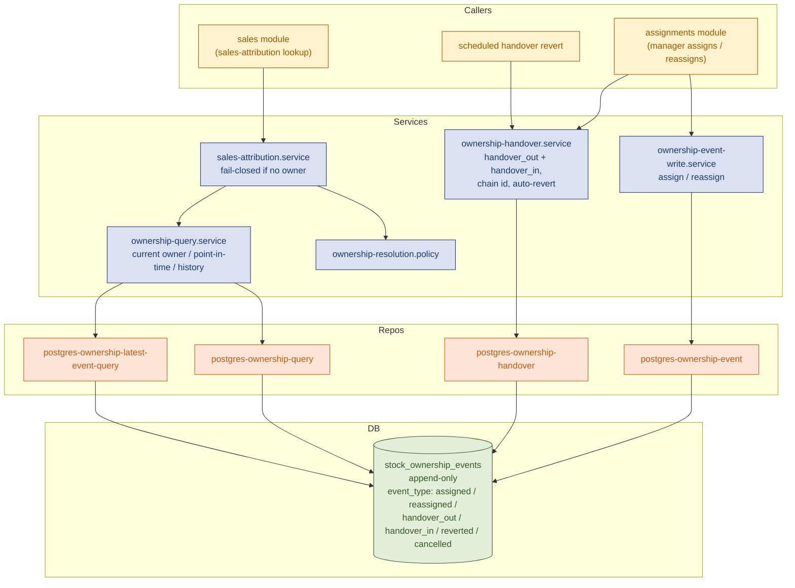

There is no `effective_to` column. Reassignments and reversions are new events; correctness depends on event ordering by `(sku_id, location_id, effective_from DESC)`.

### 5.4 `assignments` — manager-driven worker / stock assignment

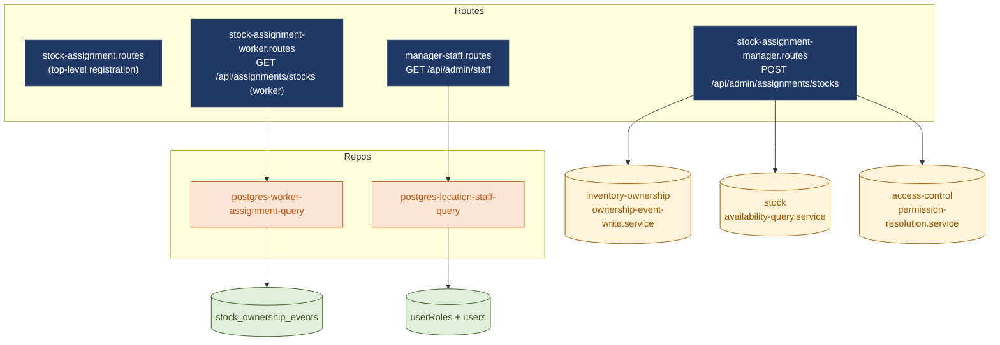

The assignments module is intentionally thin: it shapes inputs from the manager screen, then delegates writes to `inventory-ownership` and reads to access-control + ownership.

---

## 6. Commerce and fulfillment

### 6.1 `sales` — invoices, POS, returns

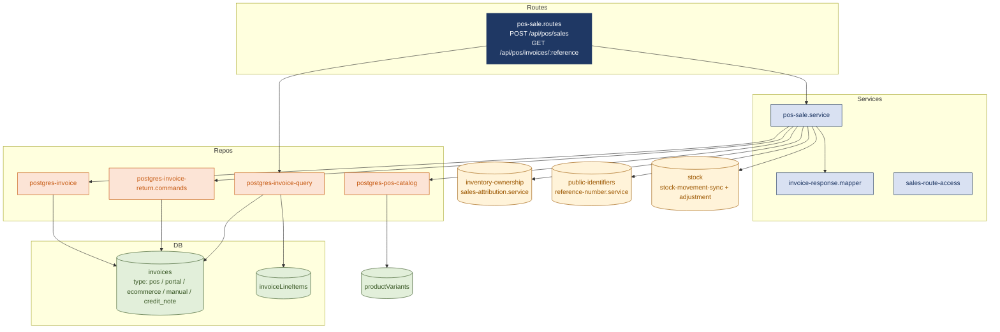

Sales attribution is mandatory and fails closed: if no authoritative owner exists in the ledger at sale time, the sale is rejected.

### 6.2 `deliveries` — scaffold

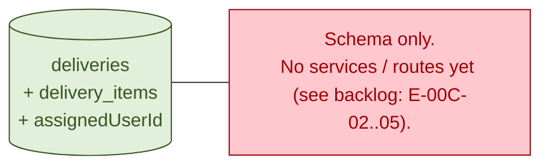

### 6.3 `official-documents` — issued snapshots, PDFs, settings

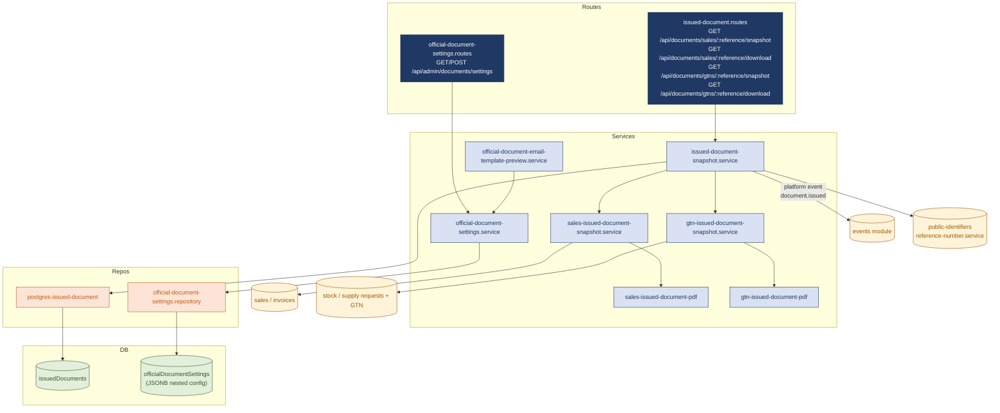

---

## 7. Coordination

### 7.1 `notifications` — projection of platform events

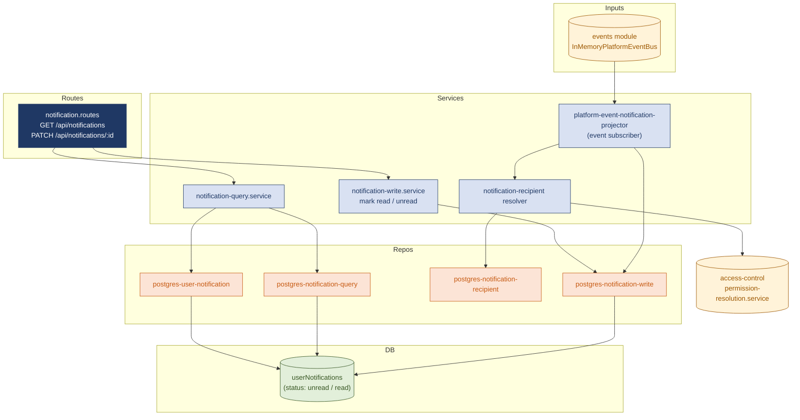

Audience resolution is permission-driven: if a platform event targets `inventory.read` at a location, the projector materialises one notification per user who currently holds that permission for that location.

### 7.2 `messaging` — email send and webhook ingestion

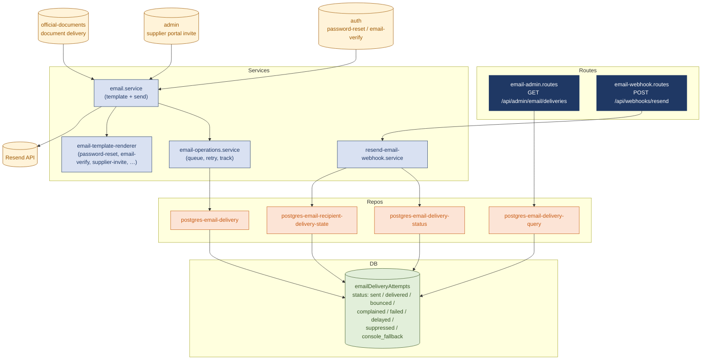

If Resend is not configured, `email.service` falls back to a console writer; the attempt still lands in `emailDeliveryAttempts` with `status = console_fallback` so admins can see what would have been sent.

### 7.3 `admin` — composition surface for admin and supplier portals

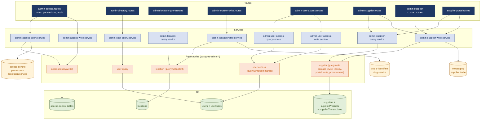

`admin` is intentionally a composition layer: it owns admin-only screens and supplier-portal flows, and it composes services from access-control, locations, public-identifiers, and messaging. Domain rules live in the leaf modules, not here.

### 7.4 `locations` — schema only

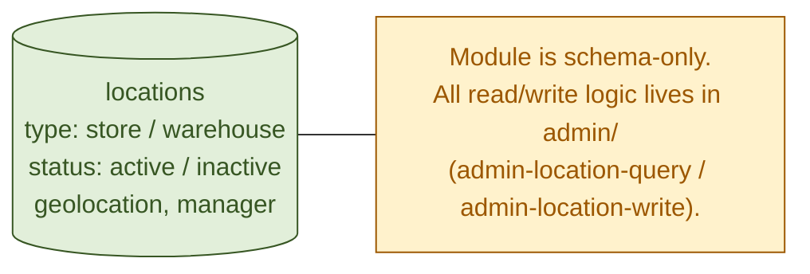

### 7.5 `system` — health and operational endpoints

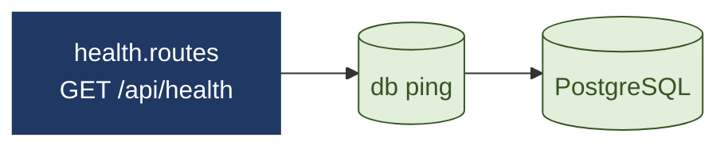

---

## 8. End-to-end request flows

These show how the modules compose for two characteristic operations.

### 8.1 POS sale

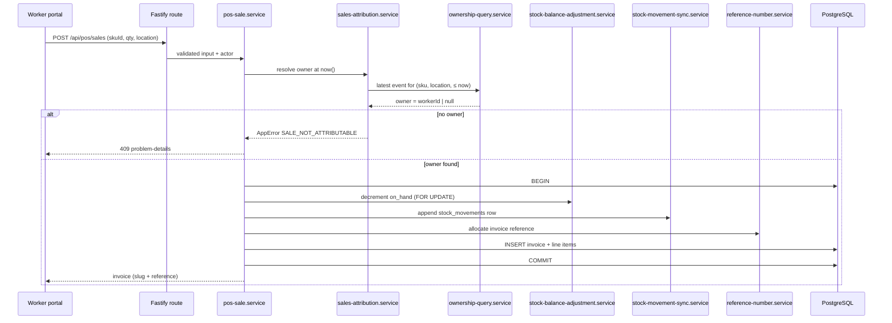

### 8.2 Stock supply request lifecycle (with platform events)

```mermaid
sequenceDiagram
    participant Mgr as Manager portal
    participant Edge as Fastify route
    participant Sup as stock-supply.service
    participant Pub as PlatformEventPipelinePublisher
    participant Loop as PlatformEventDeliveryLoop
    participant Notif as notification projector
    participant DB as PostgreSQL

    Mgr->>Edge: POST /api/supply-requests
    Edge->>Sup: create request
    Sup->>DB: BEGIN
    Sup->>DB: INSERT stock_supply_requests
    Sup->>Pub: appendWithinTransaction(request_created)
    Pub->>DB: INSERT platform_events
    Sup->>DB: COMMIT
    Pub->>Loop: notifyAppendCommitted()

    Loop->>DB: SELECT pending platform_events
    Loop->>Notif: deliver(request_created)
    Notif->>DB: INSERT userNotifications (audience)
    Loop->>DB: UPDATE platform_event_delivery_health
```

---

## 9. Module dependency map

This summarises the cross-module imports, which are the only sanctioned coupling between modules.

```mermaid
flowchart LR
    auth --> messaging
    auth --> accessControl[access-control]
    accessControl --> events
    catalog --> publicIds[public-identifiers]
    catalog --> r2[(R2)]
    stock --> publicIds
    stock --> events
    sales --> ownership[inventory-ownership]
    sales --> publicIds
    sales --> stock
    sales --> catalog
    assignments --> ownership
    assignments --> stock
    assignments --> accessControl
    docs[official-documents] --> sales
    docs --> stock
    docs --> publicIds
    docs --> events
    docs --> messaging
    notifications --> events
    notifications --> accessControl
    admin --> accessControl
    admin --> publicIds
    admin --> messaging
    system --> none[(no module deps)]

    classDef m fill:#D9E1F2,stroke:#1F3864,color:#1F3864
    classDef ext fill:#FFF3D9,stroke:#9C5700,color:#9C5700
    class auth,accessControl,catalog,stock,sales,ownership,assignments,docs,notifications,admin,publicIds,events,messaging,system m
    class r2,none ext
```

A module may depend only on modules to its left in this list:

```
events ▸ access-control ▸ public-identifiers ▸ messaging
       ▸ catalog ▸ inventory-ownership ▸ stock
       ▸ sales ▸ official-documents
       ▸ assignments ▸ notifications ▸ admin ▸ system
```

`auth` and `_core` sit beneath everything and are imported by every module that handles a request.

---

## 10. Where this comes from

- Code paths referenced above are real on the current `apps/api/src/modules/*` tree as of 2026-04-24.
- Architectural choices are documented in `docs/architecture/adr/0001` through `0016`.
- Workstream-specific status is in `docs/product/*-workstream-*.md` and `docs/product/production-readiness-findings.md`.
- Backlog status (Done / Partial / Not Started) tracking the same modules is in `Building_and_Refining_Product_Backlog_UPDATED.xlsx`.
